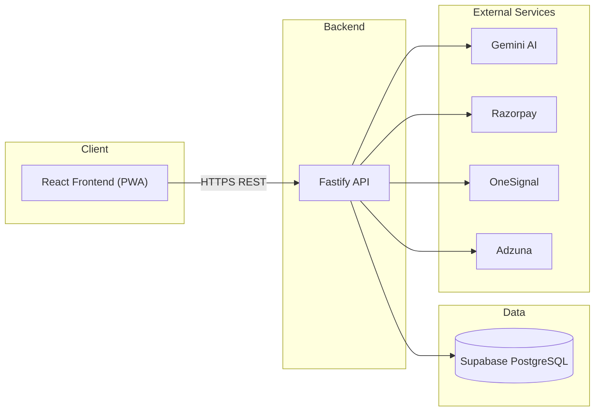

<p align="center">
  
</p>

<h1 align="center">PESiMENs</h1>
<p align="center"><strong>The Ultimate Campus Super-App for PES University Students</strong></p>
<p align="center"><a href="https://pesimens.app">pesimens.app</a></p>

<p align="center">
  
  
  
  
  
  
  
  
</p>

<p align="center">
  <strong>Author & Maintainer:</strong> Darshan P Pawar<br/>
  <a href="https://github.com/DarshanPawar7">GitHub: @DarshanPawar7</a> •
  <a href="mailto:darshanpawarworks@gmail.com">Email: darshanpawarworks@gmail.com</a> •
  <a href="https://linkedin.com/in/darshanpawar7">LinkedIn: Darshan P Pawar</a>
</p>

---

## 📖 Table of Contents

- [Quick Links](#-quick-links)
- [Repository Scope](#-repository-scope)
- [Overview](#-overview)
- [About the Maintainer](#-about-the-maintainer)
- [Features](#-features)
- [Tech Stack](#-tech-stack)
- [Architecture](#-architecture)
- [Project Structure](#-project-structure)
- [Getting Started (Frontend)](#-getting-started-frontend)
- [Contributing (GSSOC 2026)](#-contributing-gssoc-2026)
- [Beginner Tasks](#-beginner-tasks)
- [Community Docs](#-community-docs)
- [Security](#-security)
- [Privacy](#-privacy)
- [FAQ](#-faq)
- [Screenshots](#-screenshots)
- [What This Repo Does Not Include](#-what-this-repo-does-not-include)
- [License](#-license)

---

## 🔗 Quick Links

- Product site: [pesimens.app](https://pesimens.app)
- Contributing: [CONTRIBUTING.md](CONTRIBUTING.md)
- Beginner tasks: [BEGINNER_TASKS.md](BEGINNER_TASKS.md)
- Support: [SUPPORT.md](SUPPORT.md)
- Security policy: [SECURITY.md](SECURITY.md)

---

## 🧭 Repository Scope

This is the public frontend + documentation repo for PESiMENs.

| Included here | Kept private |
| --- | --- |
| Frontend UI, landing page, and public docs | Backend services, infrastructure, and operational secrets |

---

## 🌟 Overview

PESiMENs is a closed-source student platform built to bring the most useful campus experiences into one polished app. It combines learning tools, community features, career tools, entertainment, and platform services into a single product. This public repo is the community contribution and issue-tracking hub for GSSOC 2026 and contains the frontend UI plus public docs. Backend services and operational details remain private.

### At A Glance

| Item | Details |
|------|---------|
| **Product** | PESiMENs |
| **Website** | [pesimens.app](https://pesimens.app) |
| **Positioning** | Proprietary, internally maintained platform |
| **Primary Value** | A polished all-in-one student experience |
| **Public Repo Goal** | Showcase product scope, trust, and security posture |

### What Makes It Stand Out

- Clean, student-first design with a premium feel.
- Broad coverage across learning, community, career, and entertainment.
- Athena AI for quick help and navigation.
- Installable PWA experience with modern app behavior.

---

## 👤 About the Maintainer

PESiMENs is built and maintained by **Darshan P Pawar**, a solo developer who built the platform from scratch. The private repository contains **~400 commits** covering product, frontend, backend, and infrastructure work.

**Scope delivered:**

- 30+ database tables across ~90 SQL migrations
- 31 backend route modules with production-ready APIs
- Integrations with Supabase, Razorpay, OneSignal, Gemini, Groq, Adzuna, and PESU Academy sync

**Notable challenges solved:**

- Stabilizing PESU Academy sync and rate-limit handling
- Hardening auth flows and session/token handling
- Making migrations resilient and idempotent as the schema evolved
- Performance tuning for API throughput and frontend responsiveness

Detailed implementation notes and operational specifics are maintained in the private repository.

---

## ✨ Features

PESiMENs brings multiple student workflows into one experience. The feature set below is organized by user journey so the product is easy to scan and evaluate.

### 📚 Learning & Productivity

PESiMENs is designed to make everyday workflows feel simple, fast, and connected.

| Feature | What it does |
|---------|--------------|
| **PYQ Feed** | Browse, save, and organize past-year questions. |
| **AI Insights** | Turn activity into useful summaries and trends. |
| **Study Materials** | Discover and buy useful student resources. |
| **Analytics Dashboard** | View key trends in a clean visual format. |
| **Planner** | Keep schedules and important dates in one place. |

### 👥 Social & Community

The app includes social features that help students connect and engage.

| Feature | What it does |
|---------|--------------|
| **Confessions** | Anonymous posting with voting, comments, and moderation. |
| **Stories** | Temporary posts that expire automatically. |
| **Messages** | Real-time direct messaging with read-state support. |
| **People Directory** | Search profiles and build connections. |
| **Clubs** | Discover clubs and manage membership. |

### 💼 Career & Placements

PESiMENs also supports placement and mentorship workflows.

| Feature | What it does |
|---------|--------------|
| **Placement Portal** | Share and browse interview experiences, rounds, and outcomes. |
| **Mentor Marketplace** | Book mentorship sessions in a streamlined flow. |
| **Resume Reviews** | Get feedback and improve your profile. |
| **Job Search** | Discover external jobs in one place. |

### 🎮 Entertainment

The games hub mixes live titles with upcoming party-style games.

| Feature | What it does |
|---------|--------------|
| **Chess** | Play and track progress with a polished chess experience. |
| **Ludo** | Jump into multiplayer-style Ludo sessions and invites. |
| **PES Bluff** | A fast bluff-and-guess party game. |
| **PES Drawl** | A draw-and-guess game for friends. |

### 🔧 Platform

| Feature | What it does |
|---------|--------------|
| **PWA** | Installable on mobile and desktop with offline-friendly behavior. |
| **Push Notifications** | Real-time alerts for relevant app activity. |
| **Admin Panel** | Moderation and operational tools in one place. |
| **Athena AI** | Gemini and Groq-powered assistant for quick help and navigation. |
| **Explore Page** | A public discovery surface for visitors. |

---

## ✨ Highlights

- Premium, unified experience for PES University students.
- Built for discovery, engagement, and everyday utility.
- Athena AI adds fast, intelligent support across the app.
- Designed to feel modern, polished, and installable.

---

## 🛠 Tech Stack

### Frontend

- React 18
- Vite
- TypeScript
- Tailwind CSS
- TanStack React Query
- Zustand
- React Router

### Backend (Private)

- Node.js
- Fastify
- TypeScript
- Supabase (PostgreSQL, Auth, Storage, Realtime)

### PESU Sync Service

- Python
- FastAPI

### Infrastructure

- Vercel (frontend hosting)
- Render (backend + sync service hosting)

---

## 🏗 Architecture

PESiMENs uses a monorepo with a React frontend, a Fastify backend API, and a Python sync service. The frontend communicates with the backend over REST APIs, and the backend integrates with Supabase and external providers. Specific internal modules, routes, and operational details are kept private.



---

## 📁 Project Structure

High-level layout (public):

- `frontend/` React SPA
- `backend/` Backend configuration placeholder (core code is private)
- `docs/` Public documentation
- `App_logos/` Brand assets

---

## 🚀 Getting Started (Frontend)

This public repo ships the frontend UI. The backend and production services are private, so some features require mocked data or the live API.

### Prerequisites

- Node.js 18+
- npm 9+

### Install and run

```bash
cd frontend
npm install
npm run dev
```

The app runs on `http://localhost:5173`.

### Environment setup

```bash
cp .env.example .env
```

If you have access to the live API, set `VITE_API_URL` accordingly.

---

## 🤝 Contributing (GSSOC 2026)

Interested in helping out? Start with [CONTRIBUTING.md](CONTRIBUTING.md).

- Issues are tracked on this repo with GSSOC labels and clear scope.
- Contributions here focus on frontend UI and public docs.
- Branch from `dev` for contributor work and open PRs back into `dev` unless the maintainer instructs otherwise.
- If you need backend access for accurate diagnosis, request read access from the maintainer.
- **We genuinely appreciate every contribution. Contributors will be recognized in the in-app About Us section to honor their work.**

---

## ✅ Beginner Tasks

Start here: [BEGINNER_TASKS.md](BEGINNER_TASKS.md)

---

## 📚 Community Docs

| Document | Purpose |
| --- | --- |
| [CONTRIBUTING.md](CONTRIBUTING.md) | How to contribute and submit PRs |
| [BEGINNER_TASKS.md](BEGINNER_TASKS.md) | Starter-friendly tasks |
| [CODE_OF_CONDUCT.md](CODE_OF_CONDUCT.md) | Expected community behavior |
| [SUPPORT.md](SUPPORT.md) | Where to get help |
| [SECURITY.md](SECURITY.md) | Security reporting and guidance |
| [Privacy policy](privacy.md) | Privacy principles |
| [FAQ](faq.md) | Common questions |
| [Project status](docs/PROJECT_STATUS.md) | Public roadmap and status |
| [Quick start guide](docs/QUICK_START_GUIDE.md) | Frontend setup quick start |
| [Historical changelog](docs/HISTORICAL_CHANGELOG.md) | Public milestone summary |

---

## ✅ Security Snapshot

This section gives a quick public summary of the platform’s security posture.

| Area | Summary |
|------|---------|
| **Authentication** | Sensitive session handling is protected and not documented with internal implementation detail. |
| **Secrets** | No real passwords, tokens, or service credentials are stored in this repo. |
| **Validation** | User input is validated before it reaches protected app flows. |
| **Browser Safety** | Security headers, origin controls, and CSRF protections are used where relevant. |
| **Rate Limiting** | Abuse-prone features are limited to reduce spam and automated misuse. |
| **Content Safety** | Moderation and admin review protect user-generated content surfaces. |
| **AI Safety** | Athena AI uses managed backend providers and is protected from direct secret exposure. |
| **Payments** | Payment-related configuration stays outside the public repo. |

### Security Principles

- Keep sensitive values in environment variables or a secret manager.
- Treat authentication, payments, and AI provider access as private operational concerns.
- Avoid committing uploads, logs, and generated data.
- Use moderation and audit trails for user-facing content and admin actions.

---

## 🔒 Security

Security is a core part of the product design. The public repo describes the controls at a high level without exposing implementation secrets.

### Authentication & Session Security

- Authentication is separated from the public documentation and handled by the live application.
- The platform supports secure sign-in via PESU Academy credentials, Google Auth, and passwordless magic links.
- User sessions use short-lived access behavior and longer-lived refresh behavior to reduce token exposure.
- Token rotation and revocation are used to limit reuse of compromised sessions.
- Sensitive login flows are treated as protected operations and are not documented with step-by-step exploit detail.

### Data Protection

- Sensitive credentials are not stored in the public repo.
- Example environment files contain placeholders only.
- Secret values are injected through deployment-time environment variables or a secret manager.
- Production data, service keys, JWT signing values, and payment secrets are never meant to be published here.

### Application Security

- Input validation is used to reduce injection and malformed-request risk.
- Security headers and origin controls are used to limit browser-based abuse.
- CSRF protections are used for state-changing browser requests.
- Rate limiting helps reduce abuse of login, AI, messaging, and code-execution features.
- Moderation and approval flows are used for user-generated content that can affect other users.

### AI Security

- Athena AI uses Gemini and Groq as backend providers.
- AI requests are controlled through validation and abuse-prevention measures.
- Model access is treated as a managed service, not a public client-side secret.
- The public repo should not reveal provider keys, routing details, or internal prompt logic.

### Payments & Marketplace Safety

- Payment-related values are handled outside the public repo.
- Marketplace, mentoring, and purchase flows are treated as sensitive business logic.
- Public documentation should describe the existence of these features, not reveal internal processing details.

### Abuse Prevention

- Content moderation is used for user submissions.
- Audit trails are maintained for administrative actions.
- Platform features that can be abused are rate-limited and reviewed.
- The app uses a closed-source model so operational safeguards can remain private.

### Public Security Disclosure

PESiMENs follows a privacy-first and security-conscious approach. At a high level, the live product may collect:

- account and profile details needed to operate the app
- community activity created inside the platform
- basic usage and security telemetry needed for reliability and abuse prevention

PESiMENs does not collect institutional academic records such as grades, marksheets, or exam results unless a separate feature or policy says otherwise.

Authentication is handled by the live application and uses protected session flows, while sensitive credentials are never stored in this public repository.

Data should be protected in transit with HTTPS, and sensitive operational secrets should remain encrypted or stored outside the repo in deployment-time environment variables or a secret manager.

Third-party services used by the product may include hosting, authentication, storage, notifications, AI providers, payments, and other managed infrastructure services required to run the app.

Security issues should be reported through the maintainer contact listed above or through the project’s official support channel.

---

## 🔐 Privacy

- No passwords are committed to this repository.
- No live user data is included.
- No real API keys, tokens, or service credentials are present.
- Example configuration files are only templates.
- Uploaded files, logs, and build outputs should remain outside version control.

If you want to publish a privacy policy, it should explain:

- what user data is collected
- why it is collected
- where it is stored
- how long it is retained
- who can access it
- how users can request deletion or support

---

## ❓ FAQ

Common public questions about PESiMENs.

| Question | Answer |
|----------|--------|
| **What is PESiMENs?** | A private, polished campus platform for PES University students. |
| **Is this repo open source?** | No. It is public and accepts contributions, but it remains proprietary. The frontend code is public; the backend is private. |
| **Does this repo contain secrets?** | No. Only public docs and placeholder examples belong here. |
| **Where is the app live?** | The product site is [pesimens.app](https://pesimens.app). |
| **What is Athena AI?** | A built-in assistant powered by Gemini and Groq. |
| **Can I rebuild the app from this repo?** | You can run the frontend UI, but the full app requires the private backend and infrastructure. |

---

## 🖼 Screenshots

Add polished product visuals, feature callouts, and launch-ready screenshots in the [screenshots](screenshots/README.md) folder.

Suggested image types:

- hero/home screen
- Athena AI
- feed or activity view
- planner or overview view
- admin or moderation view
- mobile install view

---

## 🚫 What This Repo Does Not Include

This public repo intentionally excludes:

- core backend services
- database schema details
- secret keys and credentials
- internal debug logs
- generated files and uploads
- operational playbooks that would expose private business logic

---

## 📄 License

**All rights reserved.** This repository and its contents are proprietary and confidential. No part of this repository may be copied, modified, distributed, or used without the prior written permission of the copyright holder.

---

<p align="center">
  Built for PES University students with a strong focus on product quality, privacy, and security.
</p>
